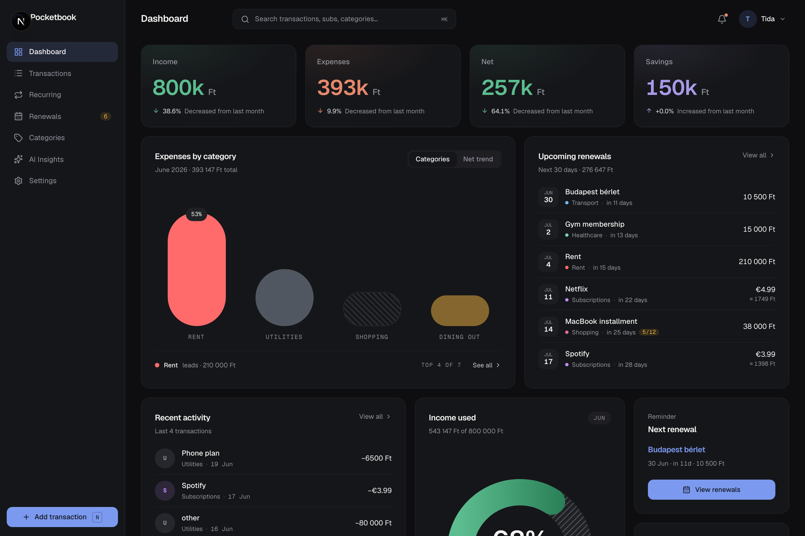
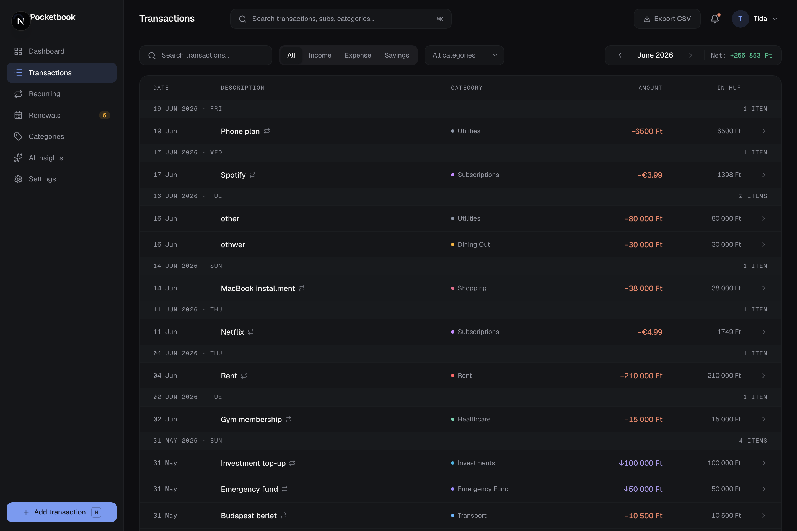
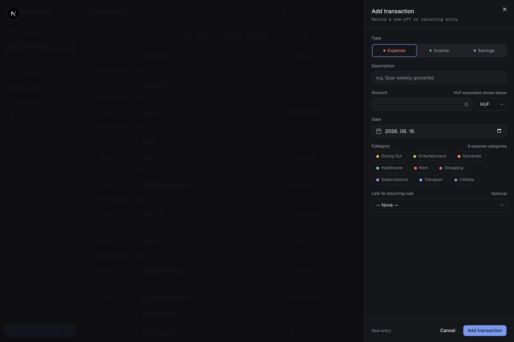
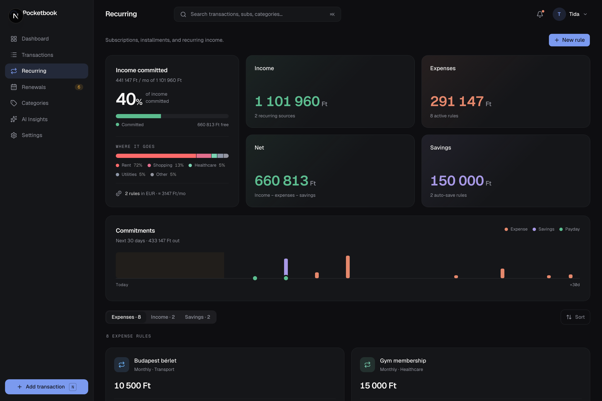
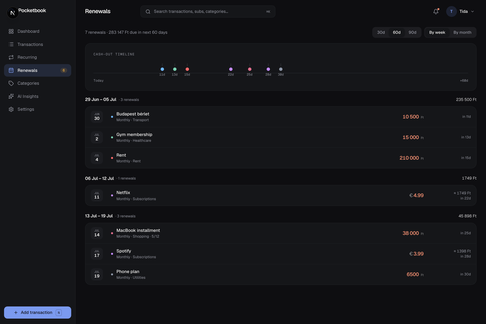
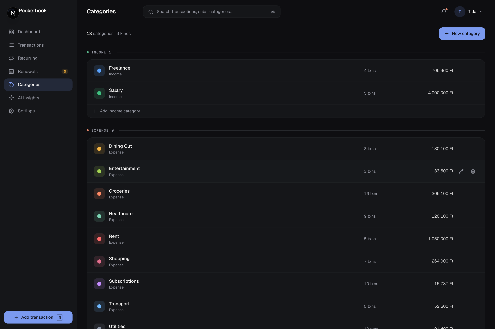
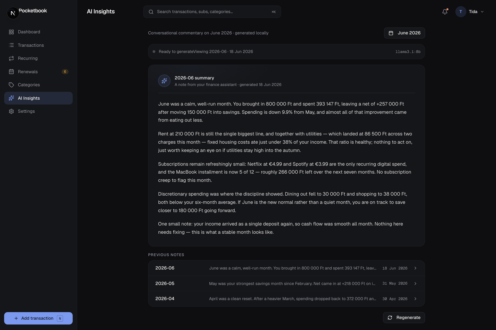
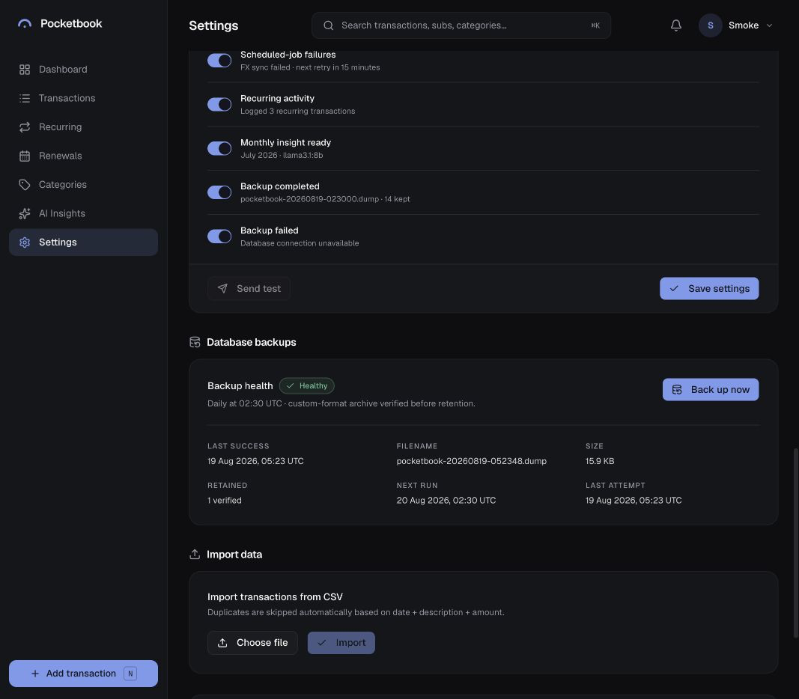

<div align="center">

<picture>
  <source media="(prefers-color-scheme: dark)" srcset="public/wordmark-dark.svg">
  <source media="(prefers-color-scheme: light)" srcset="public/wordmark-light.svg">
  
</picture>

### A calm, self-hosted personal finance tracker — with private, local AI insights.

Replace the spreadsheet. Keep your data on your own hardware. Let a local LLM read your month back to you.

[](LICENSE)
[](https://nextjs.org/)
[](https://www.typescriptlang.org/)
[](https://www.postgresql.org/)
[](#-quick-start)
[](https://github.com/traejiik/pocketbook/stargazers)

</div>

---

## What is Pocketbook?

Most finance apps want your bank login, a monthly subscription, and a copy of every transaction you've ever made — on *their* servers. **Pocketbook wants none of that.**

It's a single-user, self-hosted money tracker that replaces a manual budgeting spreadsheet with something fast, dense, and trustworthy. You run it on your own homelab, log in with your own credentials, and your financial history never leaves your machine. Every month, a **local Ollama model** reads your numbers and writes you a short, plain-English note about where your money actually went — no cloud, no API keys, no data sold.

Numbers lead. Surfaces recede. A single calm blue is reserved for what matters.

<div align="center">



</div>

---

## ✨ Highlights

- **🔒 Yours alone** — one user, seeded from your env file. No multi-tenant logic, no sign-up flow, no telemetry. Self-hosted with Docker Compose.
- **🧠 Private AI insights** — monthly commentary streamed token-by-token from your own Ollama instance. It never calls out to a third party, and the app works fine if the model is offline.
- **💱 Multi-currency, done right** — HUF-first with USD/EUR/GBP support, ECB rates auto-synced daily, triangulated conversion, and honest handling of amounts it can't convert.
- **🔁 Recurring & installments** — subscriptions, rent, and installment plans tracked with idempotent auto-logging and reconciled counters.
- **📅 Renewal radar** — a cash-out timeline that tells you what's leaving your account in the next 30/60/90 days.
- **⚡ Fast and honest UI** — optimistic writes, skeletons instead of spinners, tabular numerics on every figure, dark-mode-first, and a real `⌘K` search.
- **📥 One-way CSV import** — bootstrap from your old spreadsheet in one shot.
- **💾 Verified backups & Discord alerts** — scheduled operations, backup health, and per-event Discord controls live in Settings without extra sidecar containers.
- **📱 Installable PWA** — add to home screen and run in a standalone window.

---

## 📸 A closer look

### Transactions — dense, searchable, optimistic

Group by date, filter by type and category, and add or edit inline with optimistic updates that roll back cleanly if the server says no.



### Quick entry — a slide-over sheet, anywhere

Press `N` to log a transaction without leaving the page. Type, amount, currency, category, and an optional link to a recurring rule.



### Recurring rules — subscriptions & installments

Every subscription, rent payment, and installment plan in one place — with monthly/annual outflow totals and progress on multi-payment plans.



### Renewals — see the cash-out coming

A timeline strip plus week/month grouping so nothing surprises you on the statement.



### Categories — identity with stats

CRUD your categories, give each a colour, and see spend and frequency at a glance.



### AI Insights — your month, narrated locally

Real streaming tokens from your Ollama model, saved to the database with a feedback control and a running history of previous notes.



### Settings — operations, notifications, FX, security & the local LLM

Pick your anchor currency, manage tracked FX rates, configure Discord identity and event switches, inspect or run verified backups, change your password, and choose which Ollama model writes your insights.



---

## 🧱 Tech stack

| Layer | Choice |
| --- | --- |
| **Framework** | Next.js 16.2.6 (App Router) · React 19.2.6 · TypeScript 6 |
| **Styling** | Tailwind CSS 4.3 via CSS-first `@theme` tokens in `app/globals.css` |
| **Components** | shadcn v4 registry style · local Base UI-backed primitives · custom finance charts/SVGs |
| **Database** | PostgreSQL 16 + Prisma 7.8 |
| **Auth** | Auth.js v5 (`next-auth@beta`, credentials provider, single user) |
| **Forms** | react-hook-form + zod |
| **AI** | Local Ollama — `PB_OLLAMA_BASE_URL` in deploy env, passed to the app as `OLLAMA_BASE_URL` |
| **FX rates** | [frankfurter.dev](https://frankfurter.dev) (ECB feed), auto-synced daily |
| **Runtime / deploy** | Node 24 Alpine · supervised Next.js + UTC scheduler · PostgreSQL 16 client tools · pnpm 10.33.0 · Docker Compose · GHCR image releases |

**Architecture in one line:** server components read from Prisma directly → pass props → Server Actions mutate → `revalidatePath` + `revalidateTag` refresh. The only REST routes are for Auth.js, SSE insights streaming, and scheduler-only sync endpoints authenticated by an ephemeral per-boot token shared inside `pocketbook-web`. No client-side data fetching for initial renders.

The heavier aggregation reads (KPIs, expenses-by-category, monthly trend, upcoming renewals, category stats, recurring budget) are cached between requests with `unstable_cache` and invalidated by tag on write — see `lib/cache.ts`.

---

## 🚀 Quick start

Pocketbook ships as a Docker image. You need **Docker + Docker Compose** and a reachable **Ollama** instance (optional — the app runs without it).

```bash
# 1. Clone and copy the env template
git clone https://github.com/traejiik/pocketbook.git
cd pocketbook
cp .env.example .env

# 2. Fill in .env (see the table below). Generate secrets with:
#    openssl rand -base64 32   # PB_AUTH_SECRET

# 3. Start
docker compose up -d

# 4. Open http://localhost:3000 and sign in with
#    PB_SEED_USER_EMAIL / PB_SEED_USER_PASSWORD
```

On boot, the `pocketbook-web` container prepares `/data` and `/backups` as root, immediately re-execs as UID 1001, builds `PB_DATABASE_URL`, runs `prisma migrate deploy`, the idempotent seed, and the FX-lock backfill, then starts a PID-1 supervisor. The supervisor generates a per-boot internal job token and runs Next.js plus a separate UTC scheduler process. If either child exits or the worker stops heartbeating, the container exits so Docker can restart it.

After every successful boot the validated environment configuration is persisted to `.env-cache` on the `/data` volume (`chmod 600`); if a later redeploy arrives without variables, the entrypoint restores only the missing values. Discord configuration is separate: enter the webhook in authenticated Settings, where it is stored as `/data/notifications.json` with mode `0600` and is never returned to the browser or imported from environment variables.

### Configuration

| Variable | Required | Description |
| --- | :---: | --- |
| `PB_POSTGRES_PASSWORD` | ✅ | Postgres password (used to build the datasource URL). |
| `PB_AUTH_SECRET` | ✅ | Auth.js session secret — `openssl rand -base64 32`. |
| `PB_AUTH_URL` | ✅ | Full public URL of the instance (mapped to `AUTH_URL`). |
| `PB_SEED_USER_EMAIL` | ✅ | Login email for the single seeded user. |
| `PB_SEED_USER_PASSWORD` | ✅ | Login password for the seeded user. |
| `PB_OLLAMA_BASE_URL` | – | Your Ollama base URL, e.g. `http://homelab.local:11434`. |
| `PB_USER_DISPLAY_NAME` | – | Name shown in the sidebar header and login page. |
| `PB_INSTANCE_NAME` | – | Optional label in the login footer (e.g. `home`, `work`). |
| `AUTH_TRUST_HOST` | – | Set `true` for custom hostnames like `pocketbook.home`. |

See [`.env.example`](.env.example) for the full annotated template and [`DEPLOY.md`](DEPLOY.md) for homelab deployment notes.

### Integrated operations

Production uses two containers: `pocketbook-web` and `pocketbook-db`. The web image schedules fixed UTC jobs serially: verified backup at 02:30, FX sync at 03:00, monthly insight at 03:05 on day 1, and recurring reconciliation at 03:10. Startup catches up only the latest relevant state; failed occurrences retry every 15 minutes and emit at most one Discord failure notification per occurrence.

Backups are custom-format PostgreSQL archives written through `.partial`, checked with `pg_restore --list`, atomically promoted to `.dump`, and retained to the newest 14 under `${PB_DOCKER_DIR}/pocketbook/backups`. Settings shows health and supports an authenticated manual run. Restore remains a deliberate CLI workflow—see [`DEPLOY.md`](DEPLOY.md#restore-drill).

---

## 🧠 Private AI insights (Ollama)

Pocketbook connects to an **existing** Ollama instance — it does not run Ollama itself. Point `PB_OLLAMA_BASE_URL` at your container or machine; Docker passes it into the app as `OLLAMA_BASE_URL`:

```
PB_OLLAMA_BASE_URL=http://homelab.local:11434
```

Recommended models to pull on your Ollama host: `llama3.1:8b`, `mistral:7b`, `qwen2.5:14b`.

If Ollama is unreachable the app still works — the Insights screen shows **"Unreachable"** and the Generate button is disabled. Nothing about your finances ever leaves your network.

---

## 📥 CSV import

Bootstrap transactions from a spreadsheet export by placing a file at `seed/transactions.csv` before running `docker-compose up` (or `pnpm prisma db seed`).

```csv
date,description,amount,currency,type,category_id,recurring_rule_name
2026-01-05,Salary,450000,HUF,INCOME,salary,
2026-01-06,Spar,-8900,HUF,EXPENSE,food,
2026-01-20,Apple Music,-1990,HUF,EXPENSE,subs,Apple Music
```

- `date` — ISO 8601 (`YYYY-MM-DD`)
- `amount` — signed; negative = expense, positive = income/savings
- `currency` — uppercase 3-letter code (`HUF`, `USD`, `EUR`, `GBP`)
- `type` — `INCOME`, `EXPENSE`, or `SAVINGS`
- `category_id` — must match an existing category `id` from the seed
- `recurring_rule_name` — optional; links the transaction to a rule by name

The importer is **idempotent**: re-running it skips rows that already exist by `(date, description, amount)`. For ad-hoc imports after first boot: `pnpm tsx scripts/csv-import.ts`.

---

## 🛠️ Local development

```bash
pnpm install
cp .env.example .env          # set PB_DATABASE_URL for local dev
pnpm prisma migrate dev
pnpm prisma db seed
pnpm dev                      # http://localhost:3000
```

Useful scripts: `pnpm test` (Vitest), `pnpm lint`, `pnpm db:generate`, `pnpm db:migrate`, `pnpm db:seed`, `pnpm db:backfill-fx` (local FX-lock diagnostics), and `pnpm analyze:bundle` (per-route client JS, run after `pnpm build`).

Prisma 7 does not load `.env` implicitly, and the Prisma CLI runs outside Next.js — so `prisma.config.ts` reads `.env.local` then `.env` itself to pick up `PB_DATABASE_URL`. Real environment variables always take precedence, and a missing file is not an error, which is why the Docker runner (where `entrypoint.sh` exports the variable) is unaffected. The same loader lives in `prisma/seed.ts` and `prisma/backfill-fx.ts` for the scripts that `tsx` runs directly.

> **Careful with `pnpm db:migrate` when switching branches.** It runs `prisma migrate dev`, which treats a migration that is applied to the database but absent from `prisma/migrations/` as drift and offers to **reset the database, losing all data**. That happens whenever you apply a migration on a feature branch and then check out a branch without it. Answer no, and use `pnpm exec prisma migrate status` to inspect, or `pnpm exec prisma migrate deploy` to apply pending migrations without any reset path.

```text
app/                  Next.js App Router — pages and layouts
components/           UI primitives and finance-specific components
server-actions/       All mutations (Server Actions, no REST)
lib/                  fx.ts, auth helpers, Prisma client
prisma/               Schema, migrations, seed
prisma.config.ts      Prisma 7 CLI config; required by runtime migrations
seed/                 CSV bootstrap data (optional)
scripts/              Ad-hoc import and maintenance scripts
other/                Design reference, mockups, handoff notes
```

Deployment specifics live in [`DEPLOY.md`](DEPLOY.md).

### Releases

`main` is always deployable and protected — work happens on short-lived `feat/`·`fix/`·`chore/`
branches that PR into `main` (PR checks must pass to merge). To ship, **bump the version in
`package.json`** as part of the PR. On merge, CI tags `vX.Y.Z`, publishes a GitHub release, and
builds + pushes the `ghcr.io/traejiik/pocketbook-web` image automatically — no manual tagging or
releasing. PRs that don't change the version merge without cutting a release.

---

## 📄 License

[MIT](LICENSE) © Pocketbook
</content>
</invoke>
